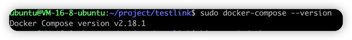
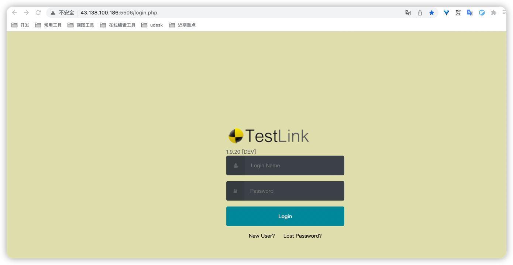

# docker网络了解
[docker网络](docker网络.md)

# docker容器与虚拟机的区别
### 区别
Docker 容器是操作系统级别的虚拟化，也称为容器虚拟化。它是在宿主操作系统上运行，与宿主操作系统共享同一内核。容器之间是隔离的，但它们共享宿主机的操作系统资源。<br>
虚拟机是硬件级别的虚拟化。每个虚拟机都有自己的独立操作系统和内核，并运行在虚拟化层之上。<br>
总结： 虚拟机相比Docker容器多了操作系统（主要内核）<br>

操作系统： 是计算机硬件和软件之间的中间层，它是管理计算机系统资源和提供用户与硬件交互的软件。<br>
操作系统的主要功能包括：<br>
处理器管理：控制和分配处理器资源，使多个进程可以在处理器上交替执行。<br>
内存管理：分配和管理计算机的内存资源，确保不同进程和应用程序可以共享内存空间。<br>
设备管理：管理计算机的设备驱动程序，使应用程序可以访问硬件设备。<br>
文件系统：管理计算机的文件和目录，允许应用程序读取和写入文件。<br>
用户接口：提供用户与计算机交互的界面，如命令行界面或图形用户界面（GUI）。<br>

内核是操作系统的核心组件，它是操作系统的一部分，负责管理计算机硬件和提供基本的系统服务。<br>
内核控制计算机的所有硬件资源，并执行操作系统的核心功能，如进程管理、内存管理、设备管理等。<br>
### 使用场景
Docker 容器适用于轻量级、可移植的应用程序部署和容器化环境，特别适用于微服务架构和持续集成/持续部署（CI/CD）流程。<br>
虚拟机适用于复杂的应用程序、多个操作系统的部署和传统的应用程序虚拟化。
# docker-compose 安装
```bash
# 下载docker-compose 二进制包,同时保存到 /usr/local/bin/docker-compose 路径下
sudo curl -L "https://github.com/docker/compose/releases/latest/download/docker-compose-$(uname -s)-$(uname -m)" -o /usr/local/bin/docker-compose

# 授予下载的二进制文件写权限
sudo chmod +x /usr/local/bin/docker-compose

# 验证是否安装成功
docker-compose --version
```


# docker-compose启动截图
[docker-compose.yml](docker-compose.yml)

