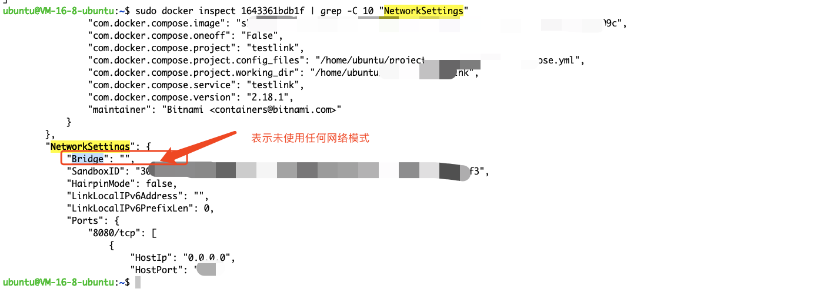

# 网络模式
> 用于控制容器之间和容器与主机之间的通信方式

## 操作
### 查看使用的网络模式
```bash
sudo docker inspect 1643361bdb1f | grep -C 10 "NetworkSettings"
```

**Briage对应不同值的含义:**

- bridge: 使用桥接网络模式，容器连接到宿主机上的 docker0 网桥。
- host: 使用主机网络模式，容器与宿主机共享网络命名空间，直接使用宿主机的网络接口。
- none: 使用无网络模式，容器不连接到任何网络。
- container:<container_id>: 使用容器网络模式，容器与另一个指定容器共享网络命名空间。
- "": 表示使用自定义网络模式
## 桥接模式 | bridge
> 是docker默认的网络模式
> 每个容器在创建时有一个自己的网络命名空间

### 功能

- 使同一网桥下的容器相互访问(容器ip+端口访问 / 容器网络别名+端口访问)
- 允许容器和主机间通信(主机IP+端口访问)
### 缺点

- 性能开销;即每个容器都创建一个独立的网络命名空间
- IP地址冲突
- 容器名称冲突
- 网络不稳定;即容器IP是动态的
### 优点

- 容器间通信
- 容器主机间通信
- 网络隔离
- 简单易用
### 使用场景

- 容器间需要通信,容器与主机需要通信场景
- 如果是需要更高级的网络隔离和配置,则不适合使用它
### 原理
#### Linux的网桥
> bridge 模式是基于Linux的网桥实现的,网桥可以将Linux的内部网络接口连在一起


当网络接口A收到数据包后,网桥会将数据包复制发送给连接到网桥的其他接口(如,网卡B,网卡C)
#### docker0
> docker 通过linux的网桥实现了bridge模式
> 是宿主机虚拟出来的,不是真实存在的网络设备,外部网络无法搜索到,意味着外部网络无法直接通过容器IP访问容器


1. docker在启动(start)时,默认创建一个名为docker0的网桥,并将其的ip地址设为172.17.0.1/16
2. 创建docker容器时,会通过[虚拟网络设备对 veth-pair](#caVCz) 来将容器与docker0连接起来
3. 对于172.17.0.0/16网段的数据包,Docker会定义一条iptables NAT的规则来讲这些数据包的ip地址转换成公网IP地址,然后通过真实的网络接口(如ens160)发送出去
### 操作
#### 创建
```
docker network create [网桥名称]

-d : 指定网桥类型。默认是bridge
```
#### 查看
###### 网络列表
```bash
# 查看网桥列表
[omnuat@WCN-GZU-OMNAPP3 ~]$ sudo docker network ls
NETWORK ID     NAME            DRIVER    SCOPE
fd3f4a6ae67f   bridge          bridge    local
397901b44839   host            host      local
074df323c233   none            null      local
59fba787c306   xxxxxx   bridge    local


# 查看某网桥详细信息
[omnuat@WCN-GZU-OMNAPP3 ~]$ sudo docker inspect 59fba787c306
[
    {
        "Name": "xxxxxxxx",
        "Id": "xxx",
        "Created": "xxxxxxxx",
        "Scope": "local",
        "Driver": "bridge",
        "EnableIPv6": false,
        "IPAM": {
            "Driver": "default",
            "Options": {},
            "Config": [
                {
                    "Subnet": "172.18.0.0/16",
                    "Gateway": "172.18.0.1"
                }
            ]
        },
        "Internal": false,
        "Attachable": false,
        "Ingress": false,
        "ConfigFrom": {
            "Network": ""
        },
        "ConfigOnly": false,
        "Containers": {
            "xxxxxxxxxx": {
                "Name": "xxxx",
                "EndpointID": "xxxxx",
                "MacAddress": "xxxxx",
                "IPv4Address": "172.18.0.67/16",
                "IPv6Address": ""
            }
        },
        "Options": {},
        "Labels": {}
    }
]
```
###### 网桥列表
```bash
# 安装工具 
sudo apt install bridge-utils
# 查看列表
brctl show
```


###### docker0私有ip
```bash
ubuntu@VM-16-8-ubuntu:~$ ip addr show docker0
4: docker0: <NO-CARRIER,BROADCAST,MULTICAST,UP> mtu 1500 qdisc noqueue state DOWN group default
    link/ether xxxxxxxxx brd ff:ff:ff:ff:ff:ff
    inet 172.17.0.1/16 brd 172.17.255.255 scope global docker0
       valid_lft forever preferred_lft forever
    inet6 xxxxxxxxxxx scope link
       valid_lft forever preferred_lft forever
```

#### 删除
```
docker network rm [网桥的名称]
```

## 主机模式 | host
> 容器直接使用Host网络的能力,与host共享网卡,路由,转发表等
> 如:容器实例使用了80端口,则可以通过Host+80端口直接访问容器
> 实现: 当使用host网络模式启动容器时,docker会直接使用宿主机的网路命名空间

### 功能

- 容器间通信(宿主机ip+端口)
- 容器主机间通信(宿主机ip+端口)
### 缺点

- 隔离性差; 宿主机已经使用的端口,容器中不可在使用
- 容器数量受限;即容器与主机共享网络空间,所以容器数量受限于主机的网络配置和性能
### 优点

- 高性能; 容器与主机共享网络空间,没有额外的网络转发和地址转换
- 简化网络配置
- 简化端口管理
### 使用场景

- 容器与主机频繁通信/性能要求高/单机环境 可以使用
- 安全性要求高不建议使用
## 容器模式 | Container
> 将容器加入到另一个已有容器的网络命名空间,使得这些容器可以直接通过本地主机名相互访问

## 无网络模式 | None
> 容器不会连接到任何网络,完全与主机网络隔离

## 自定义网络 | Custom
> 允许用户创建自己的网络,容器可以连接到自定义网络中

# 关联知识
## veth-pair
定义: 是一种虚拟网络设备对,用于实现容器和宿主机之间通信
### 组成
由一对虚拟网卡组成,每个网卡位于不同的网络命名空间
#### eth0 | 容器中
网卡位于容器的网络命名空间中,作为容器的网络接口.
Docker将其命名为eth0,并为容器分配一个IP地址
#### veth1 | 宿主机中
网卡位于宿主机的网络命名空间中,作为宿主机的网络接口.
Docker会将这个网卡的一端连接到宿主机的docker0网桥上,使容器可以通过docker0网桥与宿主机及其他容器通信
### 优势

- 实现了容器与宿主机之间的网络隔离
- 当容器停止和删除时,相应的 'veth-pair' 也会被清理,释放资源
- 动态的创建和释放,使得容器的网络环境能够灵活,高效的进行管理和隔离

