# Docker安装
```bash
sudo apt update
# 安装docker所需依赖项
sudo apt install apt-transport-https ca-certificates curl software-properties-common
# 添加GPG秘钥，确认下载软件包的合法性
curl -fsSL https://download.docker.com/linux/ubuntu/gpg | sudo gpg --dearmor -o /usr/share/keyrings/docker-archive-keyring.gpg
# 添加Docker软件源
echo "deb [arch=amd64 signed-by=/usr/share/keyrings/docker-archive-keyring.gpg] https://download.docker.com/linux/ubuntu $(lsb_release -cs) stable" | sudo tee /etc/apt/sources.list.d/docker.list > /dev/null
# 再次更新软件包索引，确保包含新加载的软件源
sudo apt update
# 安装docker引擎
sudo apt install docker-ce docker-ce-cli containerd.io
# 启动docker
sudo systemctl start docker
# 验证docker
sudo docker --version  #Docker version 24.0.2, build cb74dfc
sudo docker -v  #Docker version 24.0.2, build cb74dfc
```

# Docker使用
### 镜像管理
#####1. 拉取镜像
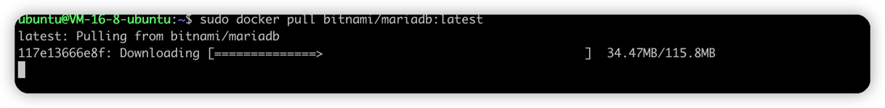

#####2. 查询镜像
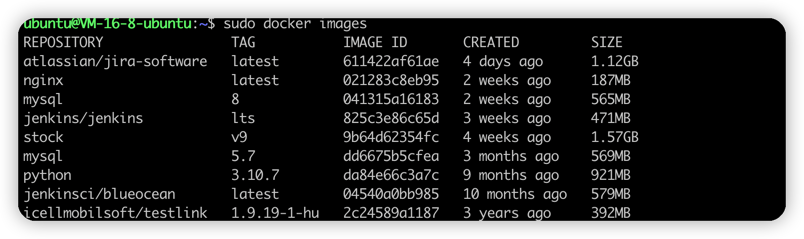

#####3. 删除镜像
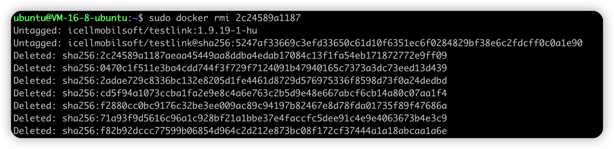
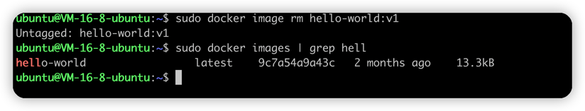

#####4. 修改标签
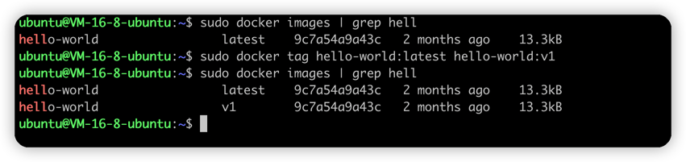

#####5. 镜像打包、解压
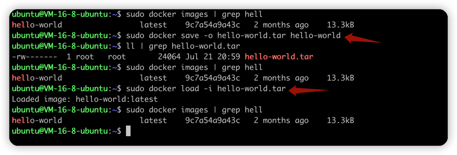

### 容器管理
#####1. 运行容器
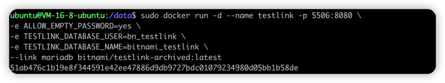

#####2. 停止容器


#####3. 启动容器


#####4. 重启容器
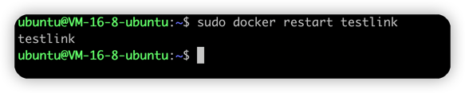

##### 查看docker进程日志
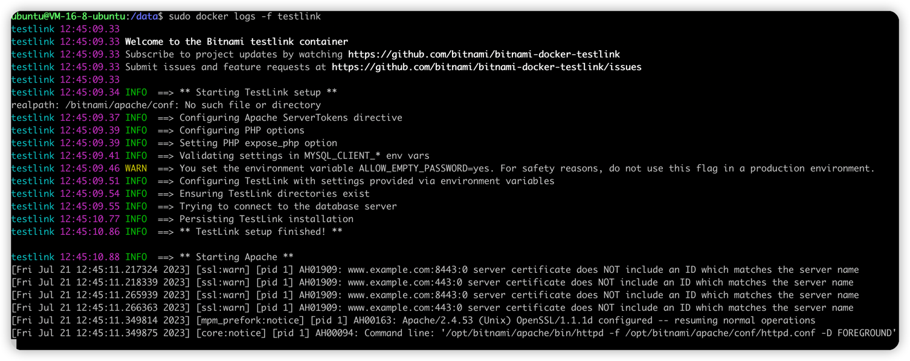

# TestLink

### 安装
```bash
#1.拉取镜像
sudo docker pull bitnami/mariadb:latest
sudo dcoker pull bitnami/testlink-archived


# 启动mariadb
sudo docker run -d --name mariadb -e ALLOW_EMPTY_PASSWORD=yes \
-e MARIADB_USER=bn_testlink -e MARIADB_DATABASE=bitnami_testlink \
-v /datas/testlink/:/var/lib/mysql \
-p 8088:3306 bitnami/mariadb:latest

# 启动testlink并连接mariadb容器
sudo docker run -d --name testlink -p 5506:8080 \
-e ALLOW_EMPTY_PASSWORD=yes \
-e TESTLINK_DATABASE_USER=bn_testlink \
-e TESTLINK_DATABASE_NAME=bitnami_testlink \
--link mariadb bitnami/testlink-archived:latest

默认账号\密码: user/bitnami
```

### 验证

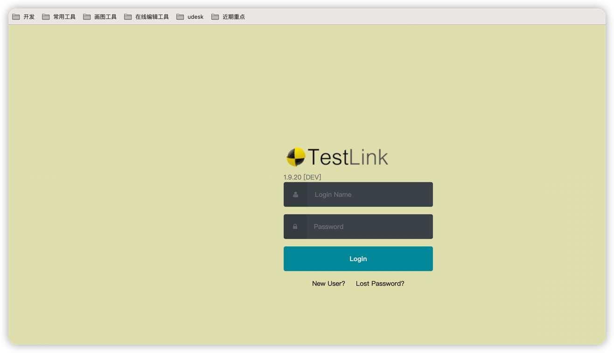
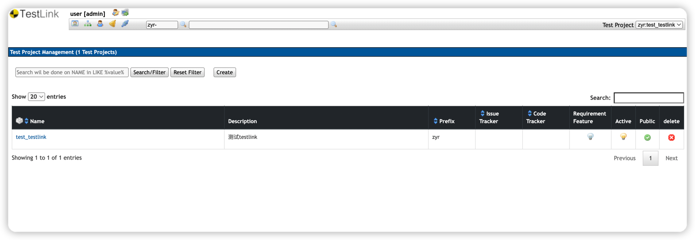