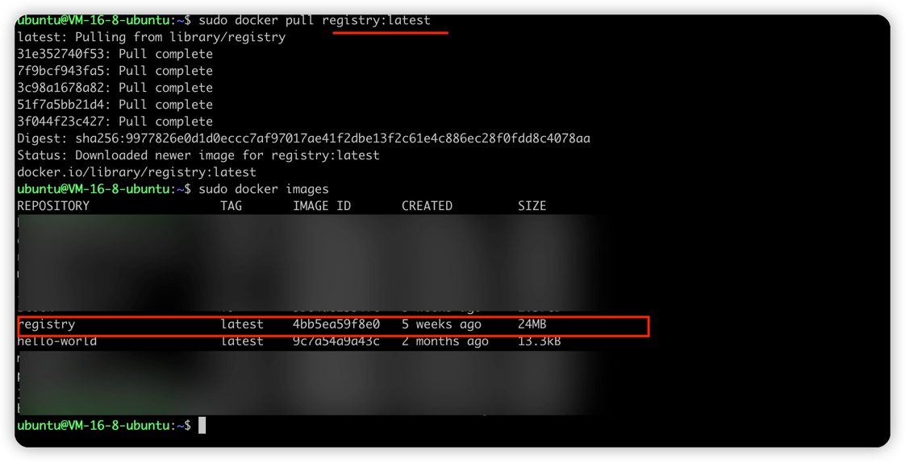
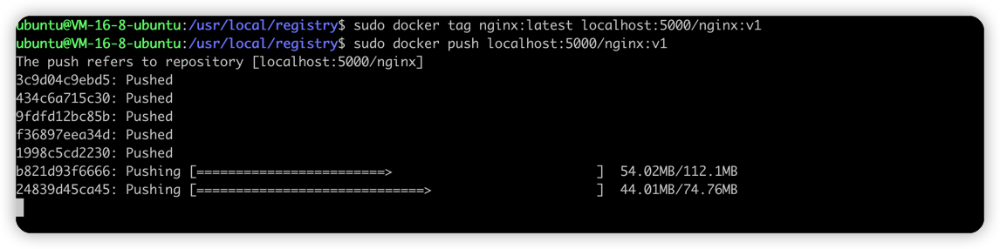
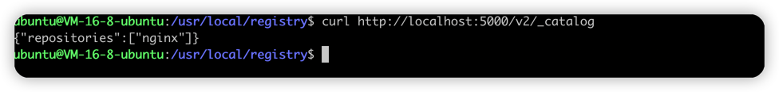
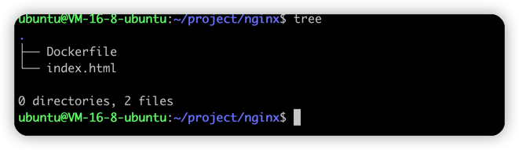
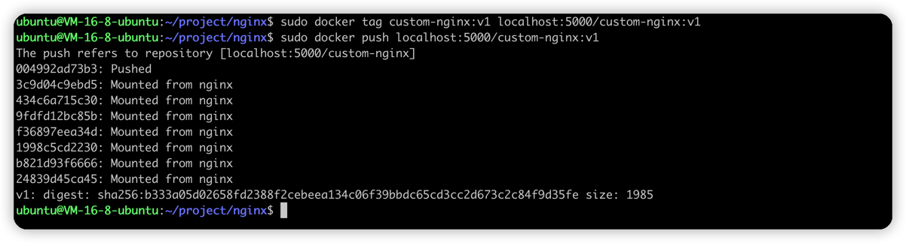
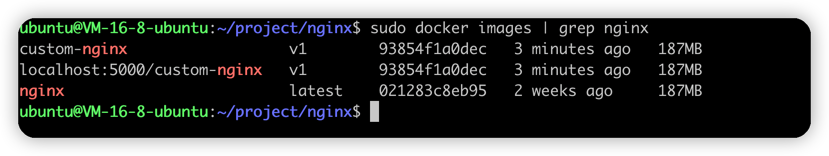
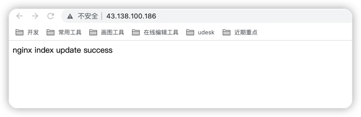

# 私有仓库搭建

### 拉取镜像


### 启动镜像
```bash
sudo docker run -d --name registry -p 5000:5000 \
-v /usr/local/registry:/var/lib/registry \
--restart=always registry:latest
```

### 推送镜像到私有仓库


### 测试


# 使用DockerFile方式修改nginx默认页

### dockerfile
```dockerfile
FROM nginx:latest
COPY ./index.html /usr/share/nginx/html/index.html
```
### index.html
```angular2html
nginx index update success
```
### 构建镜像

```bash
sudo docker build -t custom-nginx:v1 .
```
### 将制作好的镜像推送至私有仓库


### 本地镜像查询


### 页面修改成功
