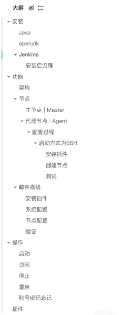

# 目录结构 

# 安装
## Java
> 安装java
> 官网下载[jdk](https://www.oracle.com/java/technologies/javase/jdk17-archive-downloads.html)

## openjdk
> brew install openjdk@17

## Jenkins
[安装Jenkins](https://www.jenkins.io/zh/doc/book/installing/#%E5%9C%A8docker%E4%B8%AD%E4%B8%8B%E8%BD%BD%E5%B9%B6%E8%BF%90%E8%A1%8Cjenkins)
```bash
# mac安装
brew install jenkins

# 镜像安装
docker pull jenkinsci/blueocean
# 启动
sudo docker run -u root -d -p 8080:8080  \
-v /home/ubuntu/project/jenkins/jenkins_data:/var/jenkins_home \
-v /var/run/docker.sock:/var/run/docker.sock \
--name jenkins jenkinsci/blueocean
```
### 安装后流程

1. ip+端口访问页面


2. 获取管理员密码
```bash
sudo docker logs -f 容器id  # 在日志中获取密码 a7cca72e12cc482dbd9b7e6beb32d4ab
```


3. 填写管理员密码，点击继续后显示如下


4. 点击安装推荐插件


5. 安装完成后点击继续，显示如下：


6. 填写信息后点击保存并完成后，显示如下


7. 无需修改，点击保存并完成后显示


# 功能

## 架构
jenkins通过使用 Master-Slave架构实现分布式构建</br>
主节点(master)负责调度构建任务,并将任务分发给代理节点(Slave)</br>
代理节点独立运行构建任务,执行后将结果返回给主节点</br>
## 节点
### 主节点 | Master
jenkins的核心服务器,负责管理任务调度和构建过程</br>
所有jenkins实例都有一个主节点,通常在启动Jenkins时会自动创建</br>
主节点通常不直接用于执行构建任务,而是将构建任务分配给其他节点</br>
**什么是jenkins实例?**</br>
jenkins实例是指安装和运行的jenkins服务器,这个服务器也被称为jenkins主节点,主要管理任务调度,构建过程,用户管理等核心概念</br>
### 代理节点 | Agent
用于执行构建任务的工作机器,也称构建代理</br>
jenkins可以配置一个或多个代理节点,用于并行构建和分布式构建任务</br>
代理节点可以是物理机,虚拟机,Docker容器,或其他计算资源</br>
配置位置: 系统管理->节点管理</br>

#### 配置过程
##### 启动方式为SSH
###### 安装插件

###### 创建节点


节点连接日志

###### 测试


## 邮件高级
### 安装插件

### 系统配置
**进入系统管理->系统配置**

**确认邮箱对应的SMTP服务是否开启**

**配置邮箱通知**


### 节点配置


### 验证

# 操作
## 启动
```bash
 brew services jenkins start
```
## 访问
```bash
http://127.0.0.1:8080/
```
## 停止
```bash
brew services stop jenkins
```
## 重启
```bash
brew services restart jenkins
```
## 账号密码忘记

1. 首先终端输入命令：
```bash
cd $JENKINS_HOME
```
   2. 输入命令 ls -ah 查找隐藏的 .jenkins 文件
   3. 输入命令
```bash
 cd .jenkins
```

4. 输入ls 查找 config.xml 文件
5. 输入命令 vi config.xml 编辑文件
6. 删除config.xml文件中下面代码
```yaml
<useSecurity>true</useSecurity>
<authorizationStrategy class="hudson.security.FullControlOnceLoggedInAuthorizationStrategy">
  <denyAnonymousReadAccess>true</denyAnonymousReadAccess>
</authorizationStrategy>
<securityRealm class="hudson.security.HudsonPrivateSecurityRealm">
  <disableSignup>true</disableSignup>
  <enableCaptcha>false</enableCaptcha>
</securityRealm>
```

7. 保存文件
8. 重启Jenkins
# 插件

1. Git Plugin：用于集成 Git 版本控制系统，支持从 Git 仓库中拉取代码、触发构建等操作。</br>
2. GitHub Integration Plugin：用于与 GitHub 代码托管平台的集成，可以实现自动化构建和部署、GitHub Webhooks 等功能。</br>
3. Build Pipeline Plugin：用于创建和可视化构建流水线（Pipeline），可以将多个构建和部署阶段组合成一个流程图，方便管理和监控整个流水线的执行。</br>
4. JUnit Plugin：用于解析和显示 JUnit 测试报告，可以查看测试结果、错误和失败的测试用例等。</br>
5. Cobertura Plugin：用于代码覆盖率报告，可以生成代码覆盖率的统计信息，并显示在 Jenkins 中。</br>
6. Checkstyle Plugin：用于静态代码分析，可以检查代码中的编码规范和质量问题，并生成相应的报告。</br>
7. SonarQube Scanner Plugin：用于集成 SonarQube 静态代码分析工具，可以在构建过程中执行代码质量检查，并将结果反馈给 SonarQube 服务器。</br>
8. Docker Pipeline Plugin：用于与 Docker 容器化平台的集成，可以在 Jenkins Pipeline 中使用 Docker 进行构建和部署操作。</br>
9. Email Extension Plugin：用于发送电子邮件通知，可以在构建失败、构建成功等事件发生时发送邮件给相关人员。</br>
