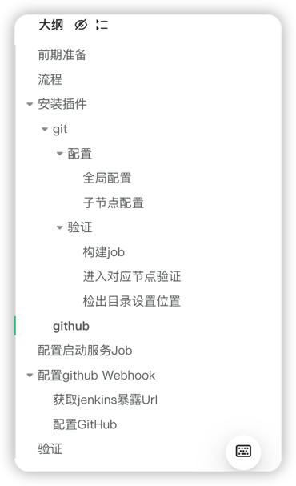

# 目录

# 前期准备
1.确保github/gitlab/其他SCM与jenkins时互通的 
2.在执行job的目标节点上安装git 
3.在jenkins上需要安装的插件Git 
4.在jenkins上需要安装的插件GitHub
# 流程

# 安装插件
## git

### 配置
#### 全局配置

#### 子节点配置

### 验证
**创建job**

#### 构建job

#### 进入对应节点验证

#### 检出目录设置位置

## github

# 配置启动服务Job

# 配置github Webhook
## 获取jenkins暴露Url
[参考地址](https://plugins.jenkins.io/github/#plugin-content-github-hook-trigger-for-gitscm-polling)

## 配置GitHub

# 验证
> 在push master时 是否会触发job

**Github push日志**

