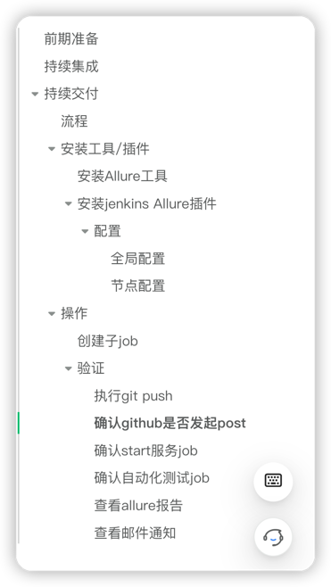

# 目录

# 安装jenkins/配置子节点/创建job执行/设置构建参数/邮件通知

[具体流程](../L2/持续集成自动化测试实战.md)


# 执行自动化测试任务

# 持续集成
[持续集成](持续集成.md)

# 持续交付，执行自动化测试任务

# 前期准备
1.安装对应版本的python</br>
2.子节点安装allure工具(allure-commandline)</br>
3.安装jenkins插件allure</br>
4.导出python项目包： pip3 freeze > requirements.txt</br>

# 持续交付
## 流程

## 安装工具/插件
### 安装Allure工具
```bash
# 安装allure
wget https://repo.maven.apache.org/maven2/io/qameta/allure/allure-commandline/2.19.0/allure-commandline-2.19.0.zip
sudo unzip allure-commandline-2.19.0.zip
```
### 安装jenkins Allure插件

#### 配置
##### 全局配置

##### 节点配置

## 操作
### 创建子job


### 验证
#### 执行git push


#### 确认github是否发起poste

#### 确认start服务job

#### 确认自动化测试job


#### 查看allure报告


#### 查看邮件通知


