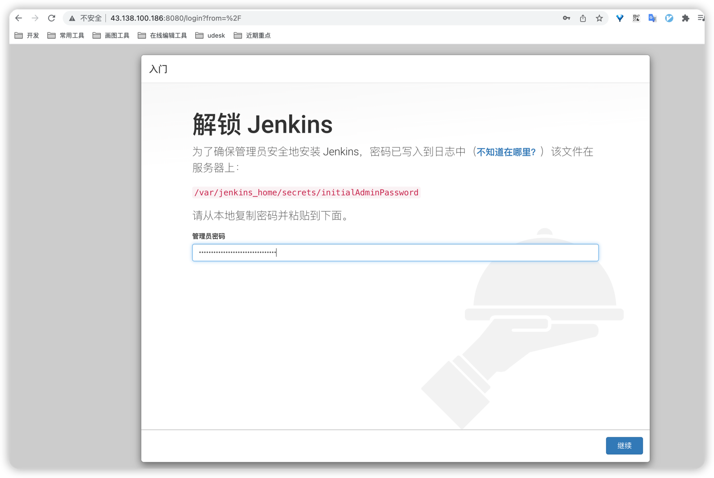
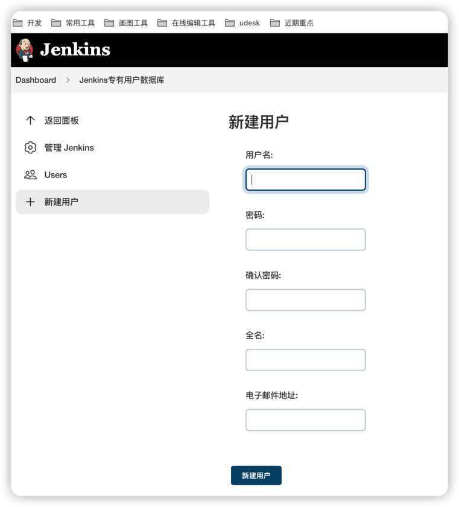
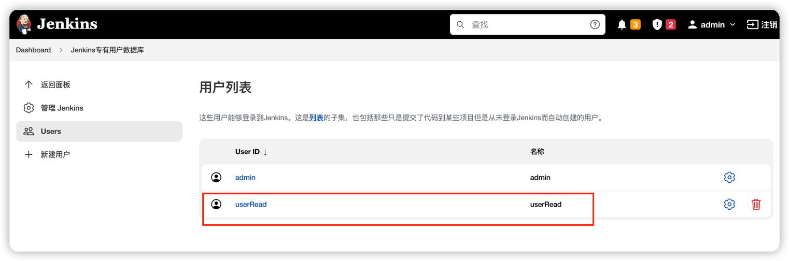
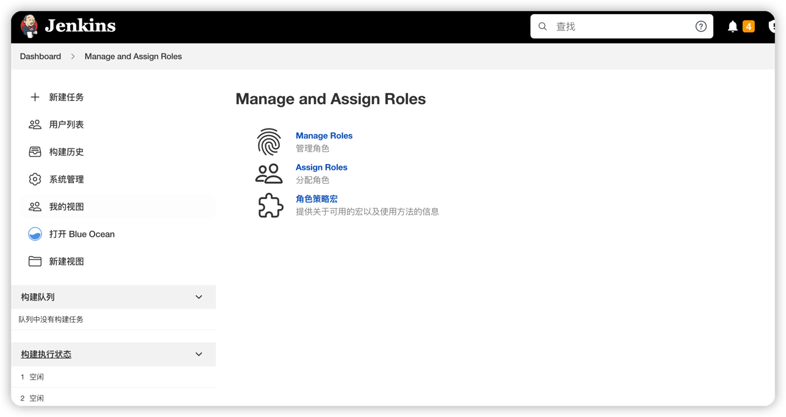
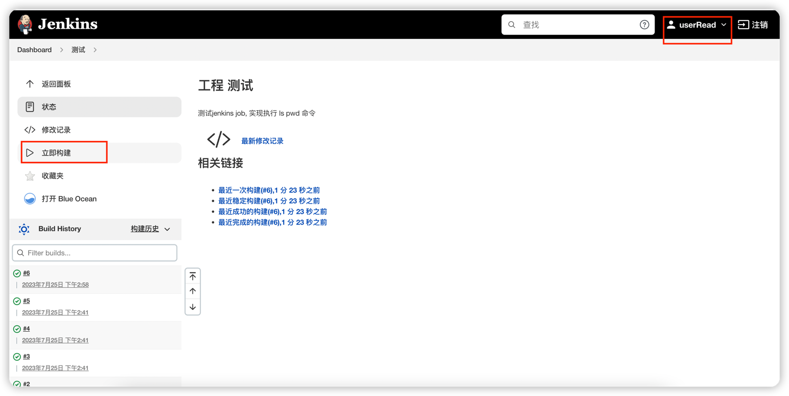
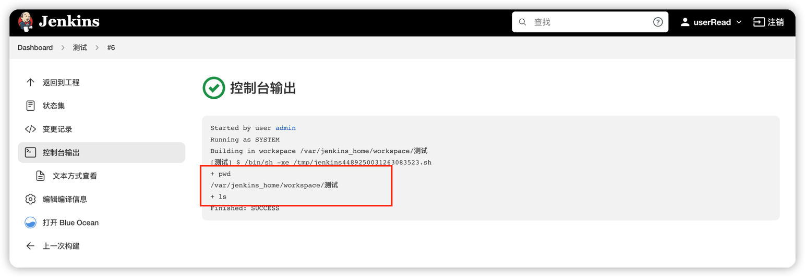

# 安装jenkins

#### 安装
```bash
# 1.安装java环境
# 2.镜像安装
docker pull jenkinsci/blueocean

# 2.未挂载目录是指权限
mkdir /home/ubuntu/project/jenkins/jenkins_data
chmod 7777 /home/ubuntu/project/jenkins/jenkins_data

# 4.启动
sudo docker run -u root -d -p 8080:8080  \
-v /home/ubuntu/project/jenkins/jenkins_data:/var/jenkins_home \
-v /var/run/docker.sock:/var/run/docker.sock \
--name jenkins jenkinsci/blueocean
```


### 验证


# 创建用户并赋予执行job权限

### 创建用户



### 授权



# 创建job并执行



