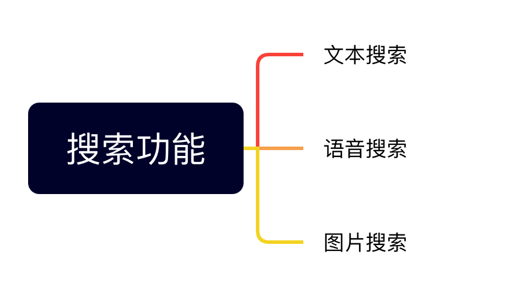
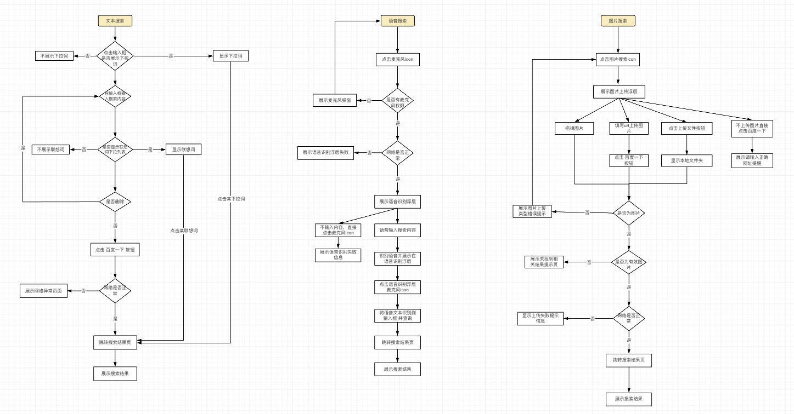
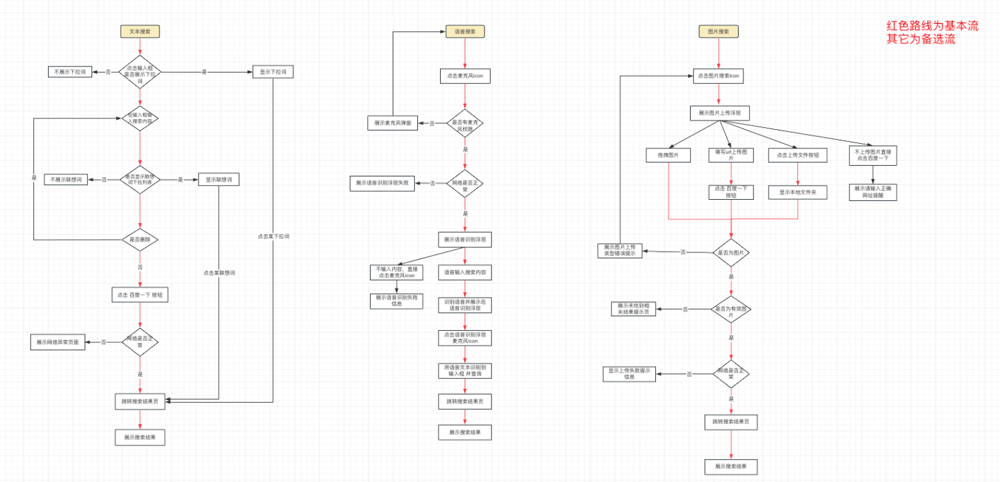
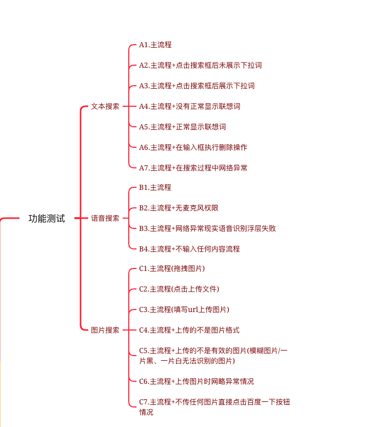
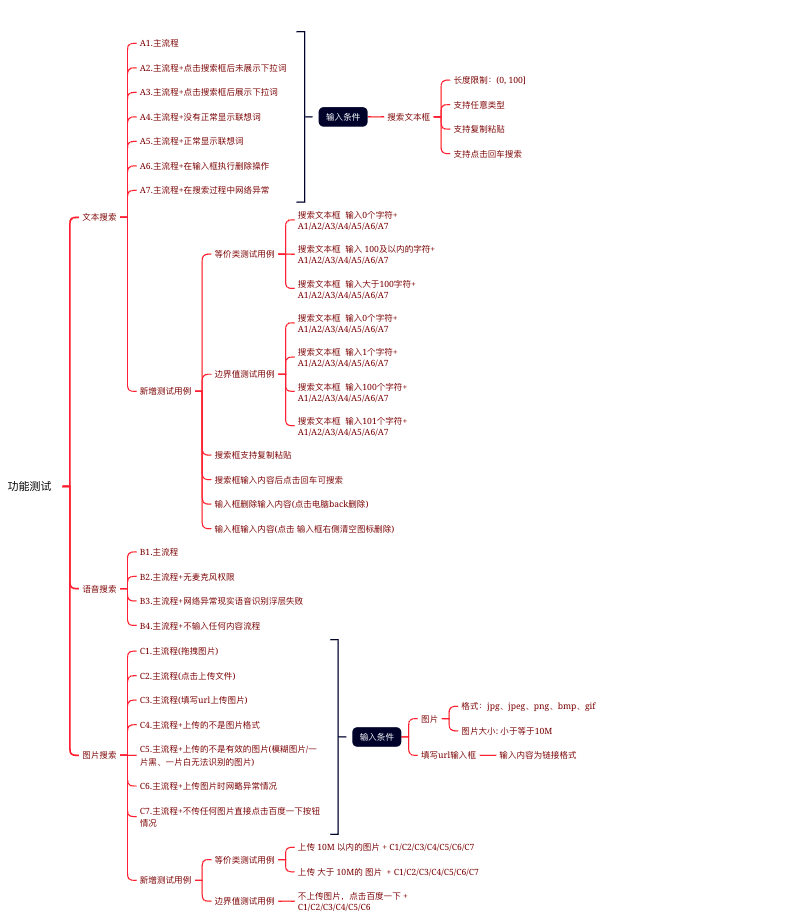
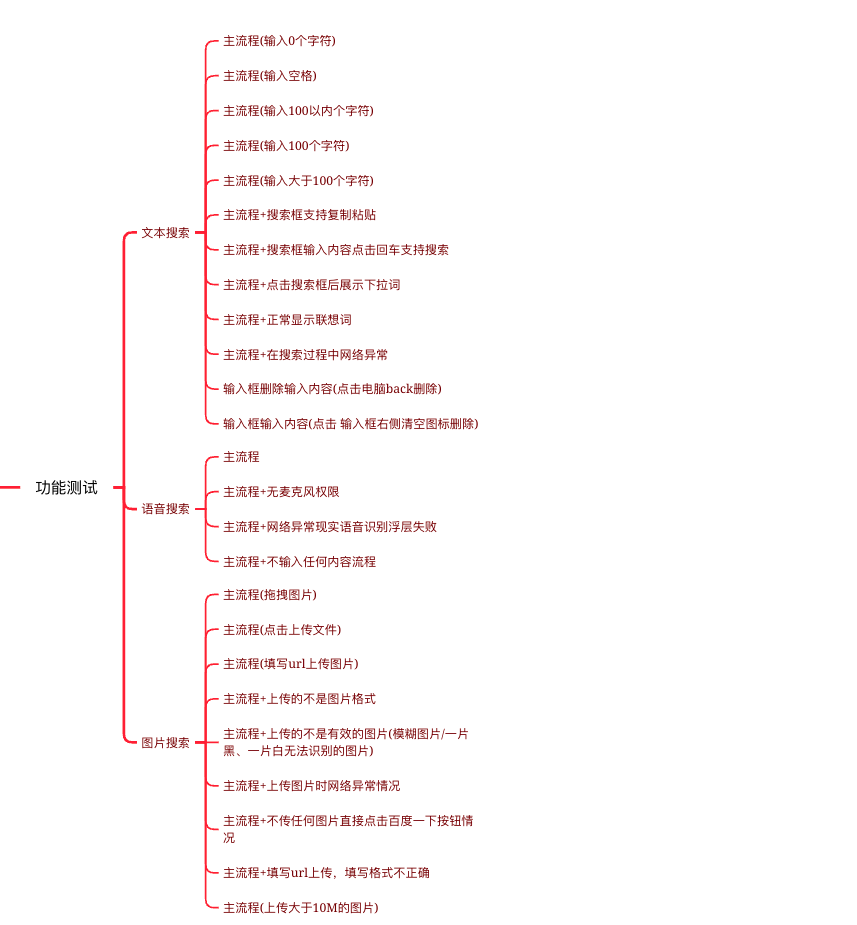
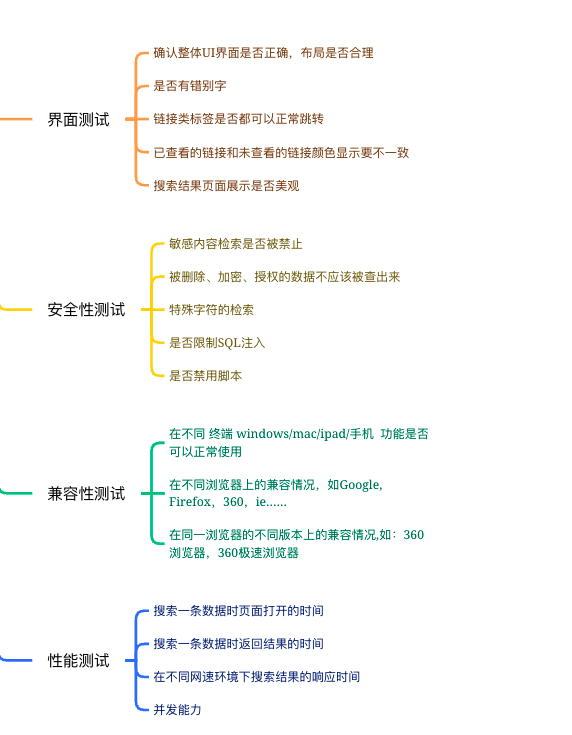
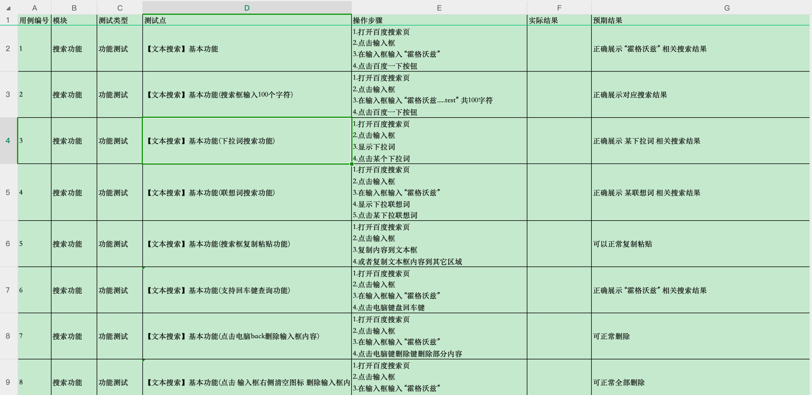

# 作业结果
搜索功能测试用例设计/搜索功能测试用例.xmind

# 实现思路
1. 整理需求
2. 画流程图详细了解需求
3. 设计测试用例
4. 确定测试数据
5. 生成最终测试用例
# 实现步骤
## 整理需求

## 画流程图详细了解需求
   
## 设计测试用例

### 实现思路
1. 使用场景法，构造场景列表
2. 针对每一个场景使用等价类划分法和边界值分析法生成测试用例
3. 对产生的所有功能测试用例重新复审，去掉多余的测试用例
4. 完善其它类型的测试用例
5. 复审测试用例
### 实现步骤
#### 构造场景列表
##### 实现思路
1. 根据流程图描述出程序的基本流和备选流
2. 根据基本流和备选流生成不同的场景
##### 实现步骤
###### 确认基本流和备选流

###### 生成场景列表

###### 针对每个场景设计测试用例
通过等价类和边界值方法设计测试用例

###### 复审功能测试用例

###### 完善其它类型测试用例

## 确定测试数据
1. 准备文本框输入数据
2. 准备图片
3. 准备语音内容
### 生成最终测试用例

