# 前提

注册个人企业微信

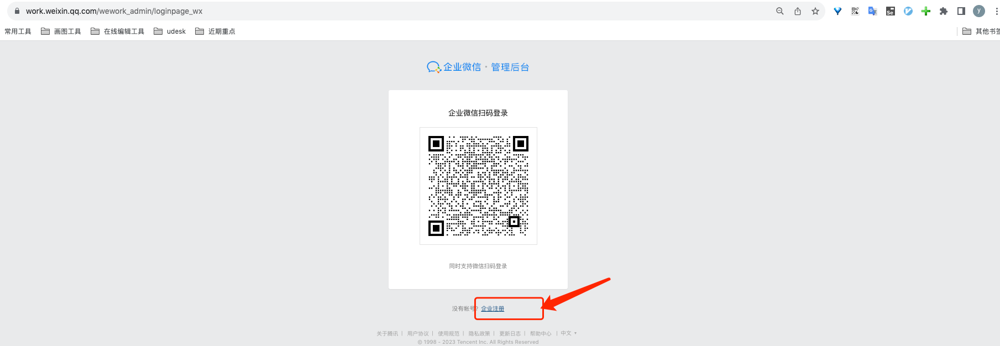
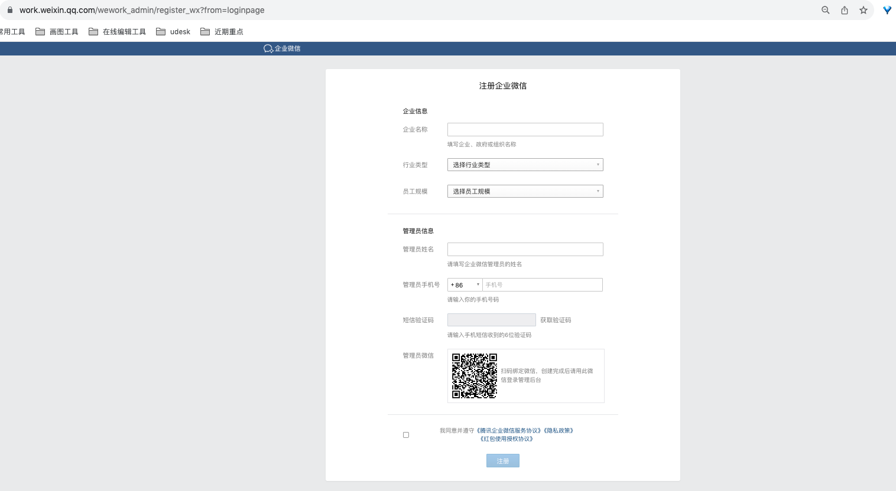

# 操作

## 画时序图梳理流程
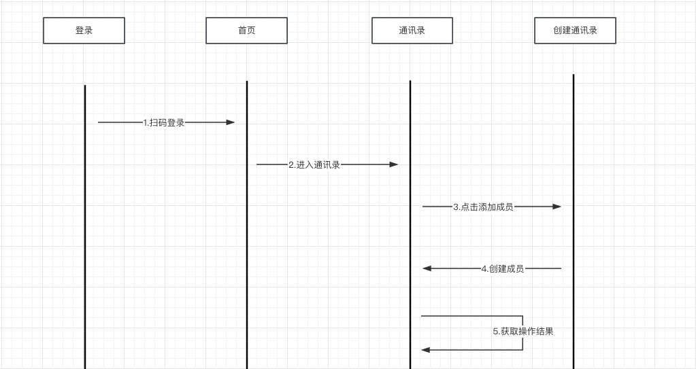

## 流程图
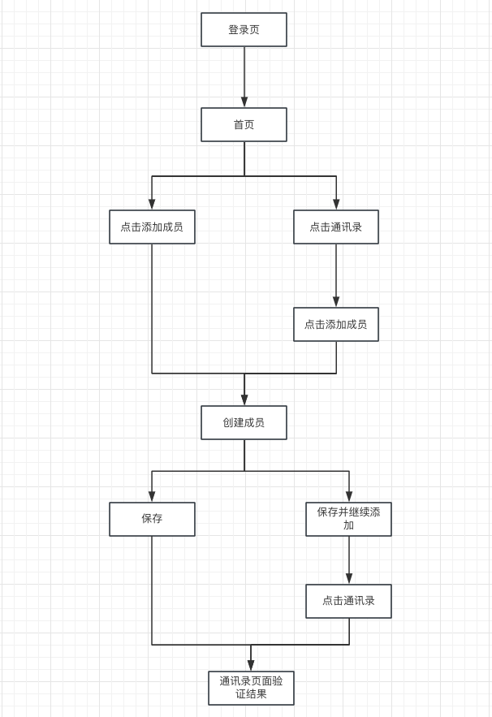

## 写测试用例

[测试用例](../dates/mock_data.yaml)

## 搭PO框架
## 补充代码逻辑

# 结果
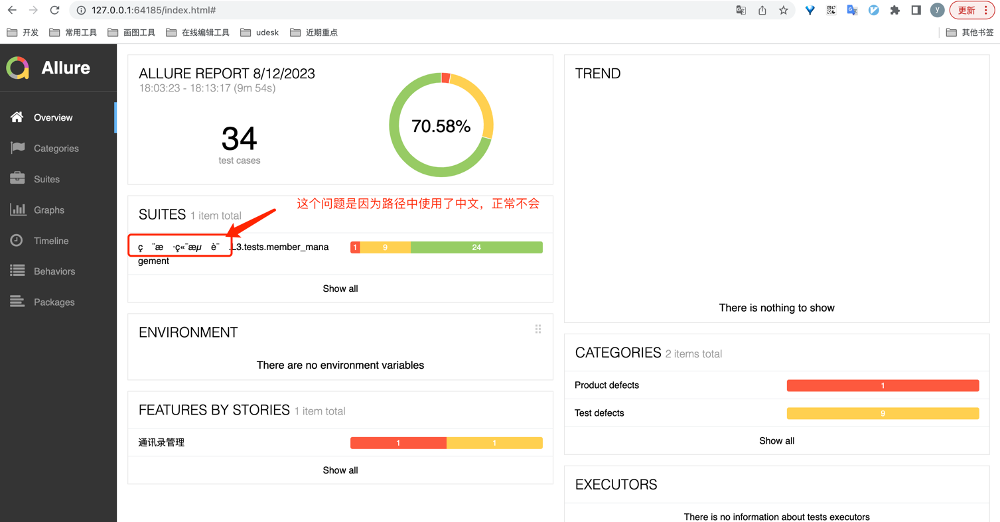
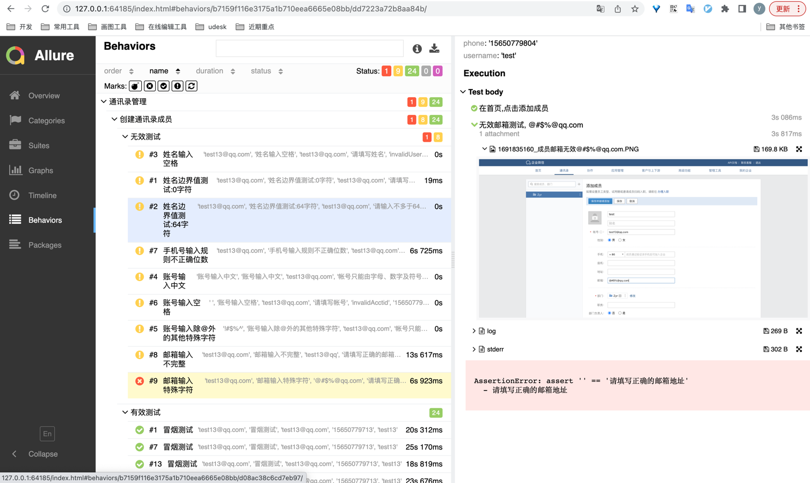

# TODO
### 问题1
用户端测试/L3/page_objects/home_page.py
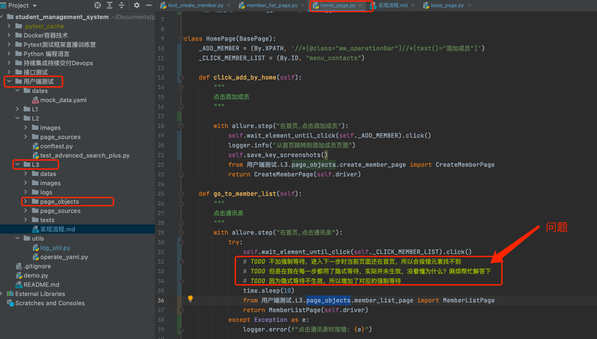

### 问题2
在实现的过程中，还是使用了很多的强制等待
1.不清楚属不属于滥用？
2.不知道怎么换成隐式等待； 可以换成隐式等待的，通过问题1，发现隐式等待不生效
3.如果可以优化，该怎么优化？

具体使用强制等待的位置：
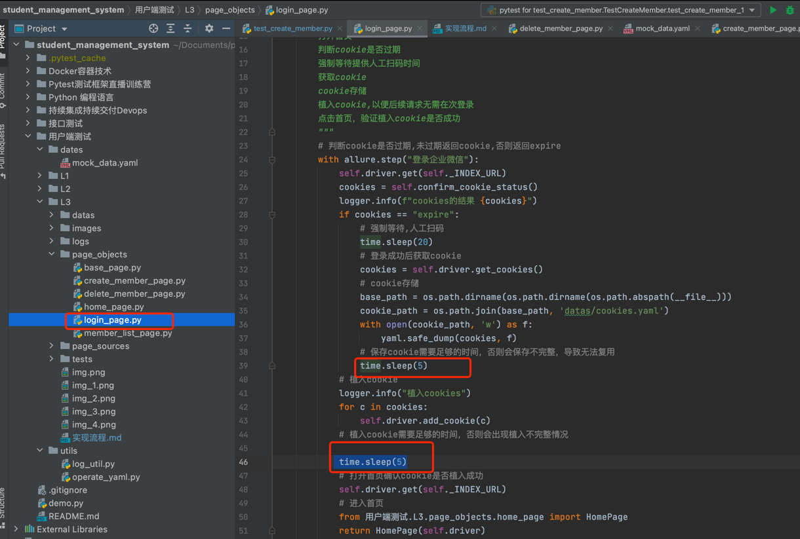
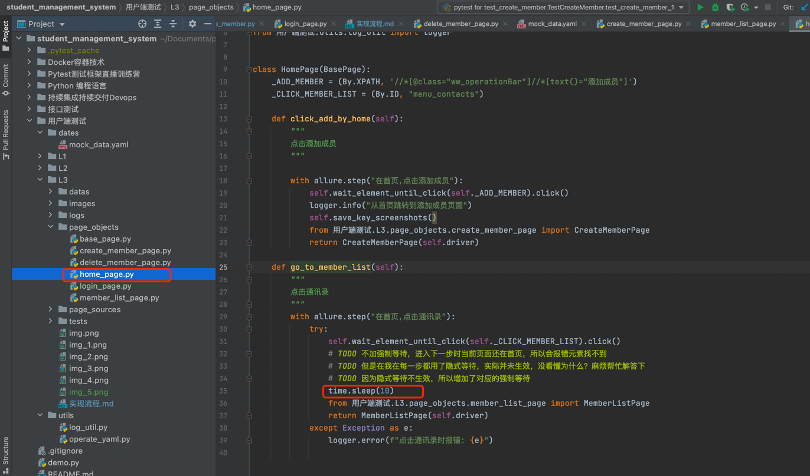
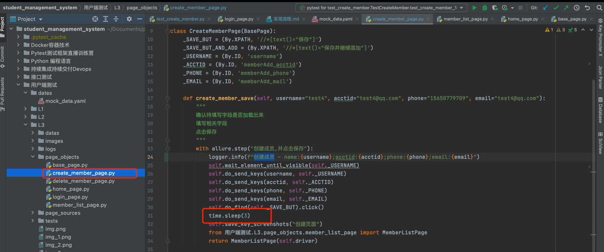

### 问题3
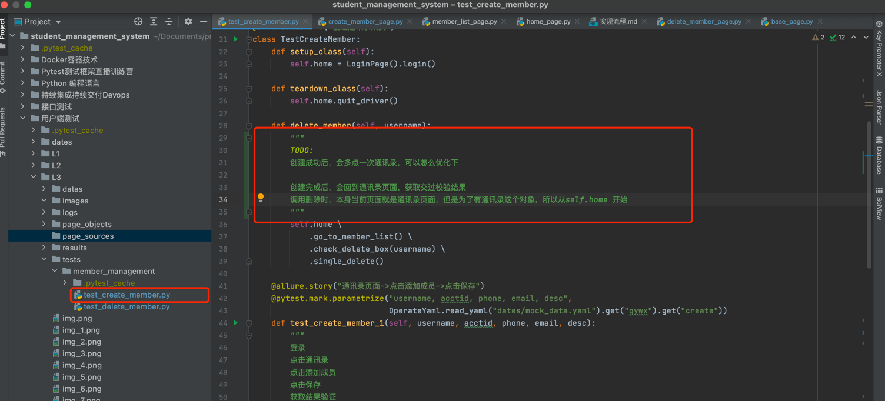

### 问题4

为什么self.home() 不能回到首页，需要单独调用self.home.back_home()
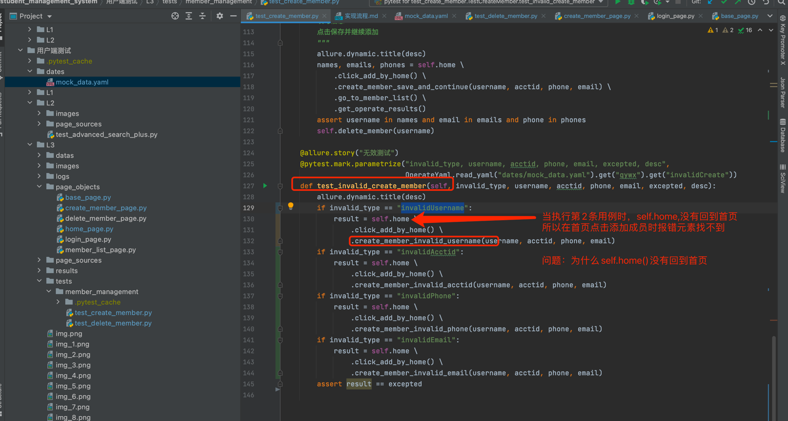
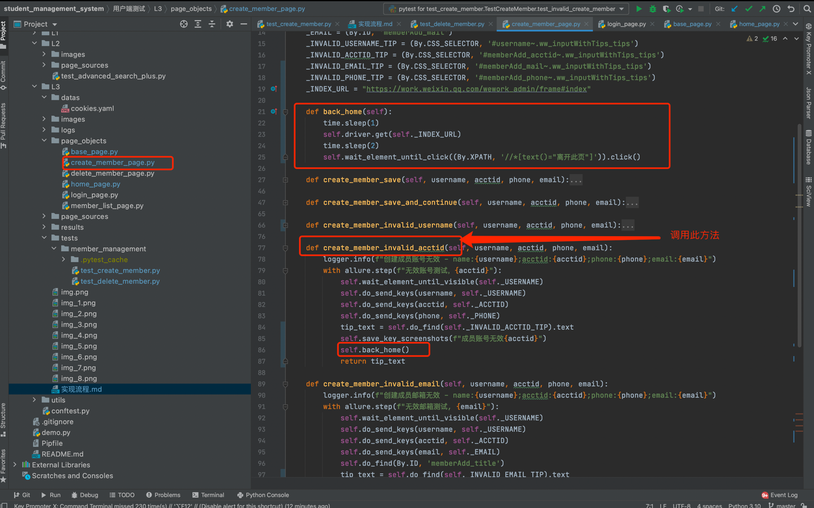