# 目录结构
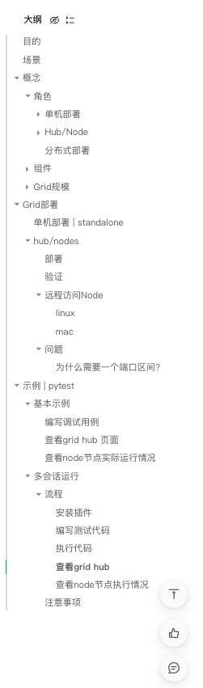

# 目的
提供一种在多态机器上并行运行测试的简单方法</br>
允许在不同的浏览器版本上进行测试</br>
启用跨平台测试</br>
# 场景
想要在不同的浏览器类型,浏览器版本和操作系统上并行运行测试时</br>
想要缩短执行测试用例的执行时间</br>
# 概念
## 角色
### 单机部署
Standalone 可以将所有Grid组件无缝的整合成一个单独的实体,在Standalone模式下运行Grid,只需一个命令即可获得一个完整的Grid,并在一个进程中运行</br>
Standalone只能在一台机器上运行</br>
#### 场景
本地使用RemoteWebDriver开发或调试测试</br>
推送代码前运行快速测试套件</br>
在CI/CD中设置简单的Grid</br>
### Hub/Node
#### Hub
##### 组成
Router/Distributor/Session Map/Session Queue/Event Bus
##### 作用
Hub 是 Selenium Grid 的控制中心，负责管理和分发测试任务给连接到它的不同节点。</br>
Hub 可以在一台机器上独立运行，也可以部署在 Docker 容器中。</br>
Hub 是一个集中的管理器，它接收测试请求，然后将请求分发给可用的 Node 节点来并行执行测试。</br>
#### Node
Node 是执行 Selenium 测试的工作单元，它连接到 Hub 并等待分配测试任务。</br>
Node 可以运行在不同的机器上，也可以在同一台机器上运行多个 Node 实例。</br>
Node 可以配置为支持不同的浏览器和操作系统，使你可以在不同环境中进行测试。</br>
### 分布式部署
每个组件都需要单独部署,单独启动,理想情况下应该位于不同的机器上
## 组件
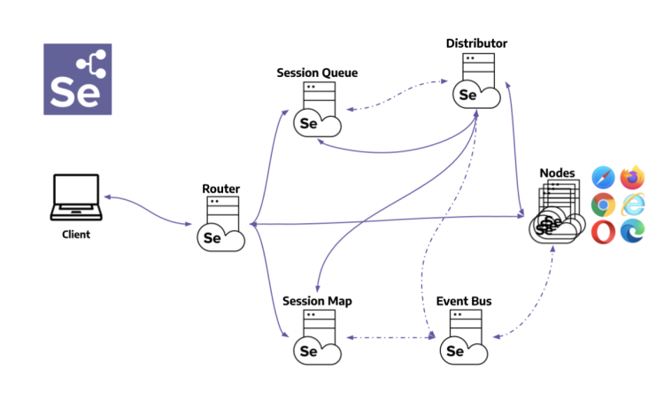
### Router
路由器是Grid的入口点,接收所有外部请求,并将他们转发给正确的组件</br>
如果是新的请求,则转发到Session Queue</br>
如果是已存在的请求,则转发到Session Map</br>
### Distributor
#### 职责
注册并跟踪所有node极其功能</br>
查询新会话队列,并处理任何挂起的新会话请求</br>
### Session Map | 会话映射
会话映射是一个数据存储,用于保存会话ID和运行会话的Node之间的关系.</br>
它支持路由器在将请求转发到Node过程中进行查询,路由器将向会话映射询问与会话ID关联的Node</br>
### Session Queue | 新会话队列
保存顺序: 先进先出</br>
路由器将新会话请求添加到新会话队列中并等待响应,新会话队列定期检查队列中是否有请求超时,如果是,则立即拒绝并将其删除</br>
分发器定期检查是否有可用的插槽,如果有可用的插槽,则分发器会轮询新会话队列已查找第一个匹配的请求,然后分发器尝试创建新会话</br>
一旦请求的功能与任何空闲的node插槽的功能匹配,分发器将尝试获取可用插槽</br>
如果所有插槽都已忙碌,则分发器将请求发送回队列</br>
如果请求在重试或添加到队列的前面时超时,则会被拒绝</br>
成功创建会话后,分发器将会话信息发送到新会话队列,该信息然后被发送回路由器,最终发送给客户端</br>
### Node
一个Grid可以包含多个Node,,每个Node管理它所在机器上可用浏览器的插槽</br>
Node通过事件总线向分发器注册自己,并将其配置作为注册消息发送</br>
默认情况下,Node会自动注册其所在机器上路径中可用的所有浏览器驱动程序,它还为基于Chromium的浏览器和Firefox创建每个可用cpu创建一个插槽,对于Safari只创建一个插槽</br>
Node仅执行接收到的命令,不评估,不做出判断或控制任何除命令和响应流之外的东西,Node所在的机器不需要与其他组件具有相同的操作系统</br>
### Events Bus | 事件总线
事件总线作为节点,分发器,新会话队列,和会话映射之间的通信路径</br>
Grid的大部分内部通信都通过消息进行,避免了频繁的HTTP调用</br>
在完全分布式模式下启动Grid时,事件总线应该是第一个组件</br>
## Grid规模
取决于: 需要支持什么样的操作系统和浏览器,需要执行多少个并行会话,可用机器数量,及机器配置(CPU, RAM)</br>
并发创建会话依赖于分配器的可用处理器.例如:一台机器有4个CPU,则分配器最多只能同时创建4个会话</br>
默认情况下最大并发会话数受CPU数量显示,若node是8核的,则最多可运行8个并发浏览器会话,预计每个浏览器会话使用大约1GB的RAM</br>
通常情况下建议,一个32核和32GM的RAM不如有32个小node,目的是更好的隔离进程</br>
### 小规模
standalone 或 Hub/Node 不超过5个nodes
### 中等规模
Hub/Node 介于6~60个Nodes之间
### 大规模
Hub/Node 介于60/100个Nodes之间,Distributed超过100个Nodes
# Grid部署
> 确认使用哪种角色部署

## 单机部署 | standalone
```
# 拉起镜像
sudo docker pull selenium/standalone-chrome
# 运行镜像
docker run -d -p 4444:4444 --name selenium-grid selenium/standalone-chrome
# 访问控制台
 http://localhost:4444/grid/console
```
## hub/nodes
### 部署
```bash
# 拉取镜像
sudo docker pull selenium/hub
sudo docker pull selenium/node-chrome

# 启动hub
sudo docker run -d -p 5442-5444:4442-4444 --name selenium-hub selenium/hub
# 验证(访问其控制台)
http://ip:5444/ui#


# 启动node1 chrome
# 其中 -v /dev/shm:/dev/shm 是将主机的/dev/shm 目录挂载到容器的/dev/shm目录,用于共享内存,已提高Chrome的浏览器性能
# 暴露的端口主要用来访问图形界面的
sudo docker run --name node-chrome -p 5902:5900 -d -e SE_EVENT_BUS_HOST=43.138.100.186 -e SE_NODE_MAX_SESSIONS=5 -e SE_NODE_OVERRIDE_MAX_SESSIONS=true -e SE_EVENT_BUS_PUBLISH_PORT=5442 -e SE_EVENT_BUS_SUBSCRIBE_PORT=5443 -e SE_NODE_CHROME_OPTS="--lang=zh-CN" -v /dev/shm:/dev/shm selenium/node-chrome

# 启动node2 firefox
sudo docker run --name node-firefox -p 5903:5900 -d -e SE_EVENT_BUS_HOST=43.138.100.186 -e SE_NODE_MAX_SESSIONS=5 -e SE_NODE_OVERRIDE_MAX_SESSIONS=true -e SE_EVENT_BUS_PUBLISH_PORT=5442 -e SE_EVENT_BUS_SUBSCRIBE_PORT=5443 -e NODE_CHROME_ARGS="--lang=zh-CN" -v /dev/shm:/dev/shm selenium/node-firefox
```
### 验证
如果出现如下页面,表示部署完成</br>
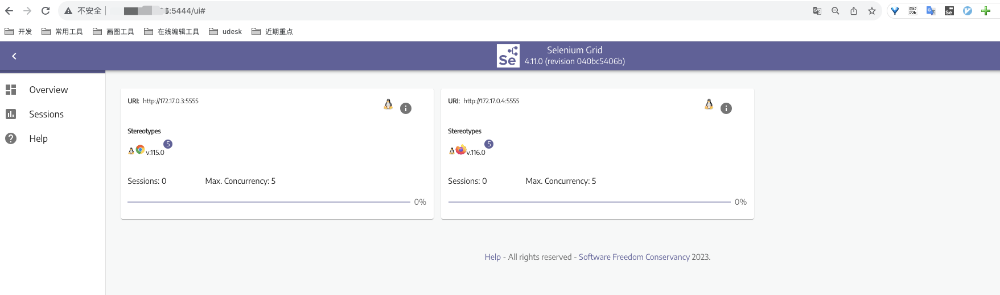
### 远程访问Node
下载软件 [Vnc Viewer](https://www.realvnc.com/en/connect/download/viewer/linux/)
#### linux
[Linux ❀ 配置使用VNC Viewer访问Linux系统的图形化界面_vncviewer linux_无糖可乐没有灵魂的博客-CSDN博客](https://blog.csdn.net/qq_42197548/article/details/120518341)
```bash
# 免费版安装
sudo apt update

# 如果提示没有vncviewer这个包,可以安装tigervnc-viewer
sudo apt install vncviewer 
sudo apt install tigervnc-viewer #是vncviewer另一个常用的包

# 还需要 安装 X 窗口系统环境
```
#### mac
[免费版下载](https://m.pc6.com/s/561489)</br>
安装成功后页面如下</br>
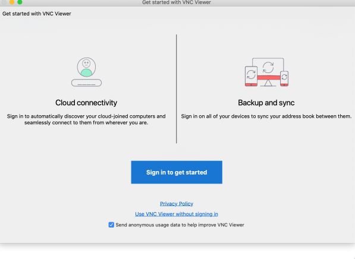
无需登录,在以下页面输入节点的ip+端口进行链接</br>
填写密码,默认secret</br>
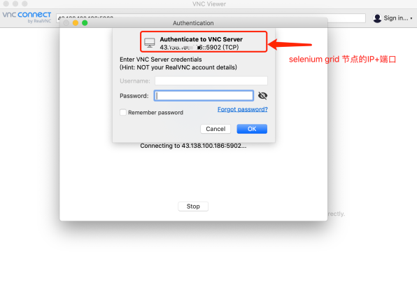
输入密码后显示</br>
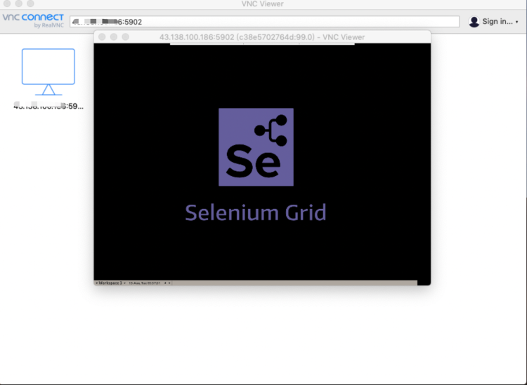
### 问题
#### 为什么需要一个端口区间?
如: 5442-5444:4442-4444</br>
selenium grid使用多个端口来管理和通信,特别是在多节点环境下,每个节点需要监听不同的端口来处理测试会话,控制台访问等,区间的端口映射是为了保证selenium grid 不同组件的端口需求,使其能够正常的工作</br>
**为什么是3个端口呢?**</br>
selenium grid hub组件通常使用以下3个服务来提供不同的功能:</br>

- Hub控制台:默认端口4444,用于访问Selenium Grid控制台,管理节点和测试会话</br>
- 节点注册(事件总线发布):默认端口5555,节点使用这个端口来注册到hub上,以便hub可以管理和分发测试任务</br>
- Hub节点通信(事件总线订阅):默认端口5556,这个端口用于hub和节点之间的通信,包括分配测试会话和控制测试执行</br>

**那映射的端口和3个服务是什么样的对应关系?**</br>
按照 Hub控制台 | 节点注册 | Hub节点通信 这个顺序一一对应</br>

- Hub组件事件总线发布端口  5442:4442</br>
- Hub组件事件总线订阅端口 5443:4443</br>
- Hub组件控制台 5444:4444</br></br>
# 示例 | pytest
## 基本示例
### 编写调试用例
```bash
# 在项目中创建一个文件grid_demo.py,将以下代码复制到文件中
# 点击运行,查看grid hub面板

import pytest
from selenium import webdriver
from selenium.webdriver import Keys
from selenium.webdriver.common.by import By
from selenium.webdriver.support import expected_conditions
from selenium.webdriver.support.wait import WebDriverWait
from selenium.webdriver.chrome.options import Options


@pytest.fixture(scope="function")
def driver(request):
    caps = {
        'browserName': "chrome"
    }
    options = Options()
    options.add_argument("--lang=zh-CN")
    driver = webdriver.Remote(
        command_executor='http://43.138.100.186:5444',
        desired_capabilities=caps,
        options=options
    )

    def fin():
        driver.quit()
    request.addfinalizer(fin)
    return driver

def test_open_baidu(driver):
    driver.get("https://www.baidu.com")
    search_box = driver.find_element(By.NAME, 'wd')
    search_box.send_keys('Selenium Grid')
    search_box.send_keys(Keys.RETURN)
    WebDriverWait(driver, 10).until(expected_conditions
                                    .presence_of_element_located((By.XPATH, '//h3[contains(text(), "Selenium Grid")]')))

    time.sleep(20) # 为了看页面结果,让其强制等待会
```
### 查看grid hub 页面
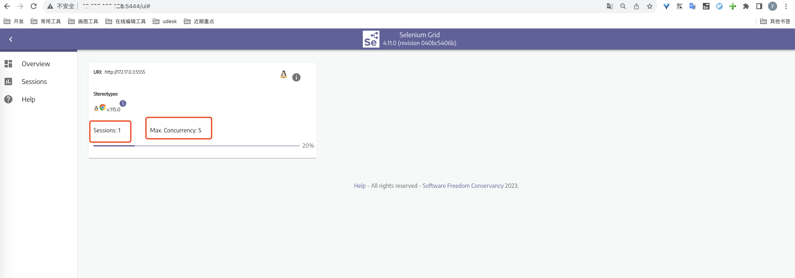
sessions(会话): 表示当期那正在运行的测试会话数量,也就是正在执行的测试任务实例数;每个会话通常对应一个独立的浏览器实例,在这个浏览器实例中运行测试</br>
Max.Concurrency: 指的是Selenium Grid允许最大并发会话数,也就是同一时间内可以同时运行的测试会话的最大数量</br>

### 查看node节点实际运行情况
使用vnc viewer工具打开节点**</br>
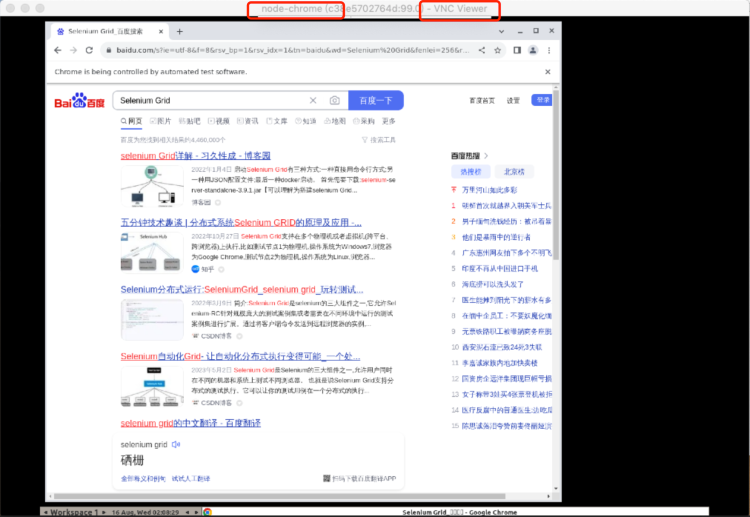
## 多会话运行
### 流程
#### 安装插件
```bash
# 要在pytest中实现并发测试会话,可以使用 pytest-xdist插件
pip3 install pytest-xdist
```
#### 编写测试代码
```bash
# 编写2个测试文件,复制以下代码到2个文件中
import time

import pytest
from selenium import webdriver
from selenium.webdriver import Keys
from selenium.webdriver.common.by import By
from selenium.webdriver.support import expected_conditions
from selenium.webdriver.support.wait import WebDriverWait
from selenium.webdriver.chrome.options import Options


@pytest.fixture(scope="function")
def driver(request):
    caps = {
        'browserName': "chrome"
    }
    options = Options()
    options.add_argument("--lang=zh-CN")
    driver = webdriver.Remote(
        command_executor='http://43.138.100.186:5444',
        desired_capabilities=caps,
        options=options
    )

    def fin():
        driver.quit()
    request.addfinalizer(fin)
    return driver

def test_open_baidu(driver):
    driver.get("https://www.baidu.com")
    search_box = driver.find_element(By.NAME, 'wd')
    search_box.send_keys('Selenium Grid')
    search_box.send_keys(Keys.RETURN)
    WebDriverWait(driver, 10).until(expected_conditions
                                    .presence_of_element_located((By.XPATH, '//h3[contains(text(), "Selenium Grid")]')))

    time.sleep(20)
```
#### 执行代码
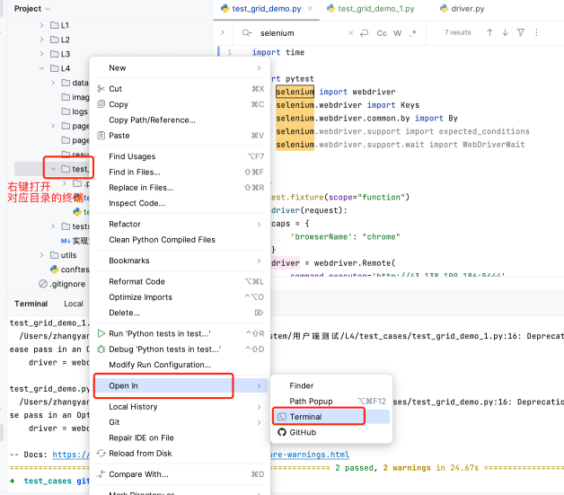
在当前终端执行如下命令, -n 2表示开启2个会话</br>
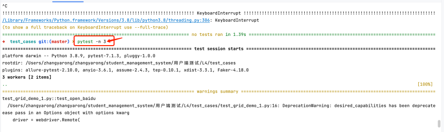
 在test_case文件下写了2个测试模块,每个模块是一个独立的浏览器实例,所以当我们指定3时,还是只有2个worker </br>

#### 查看grid hub
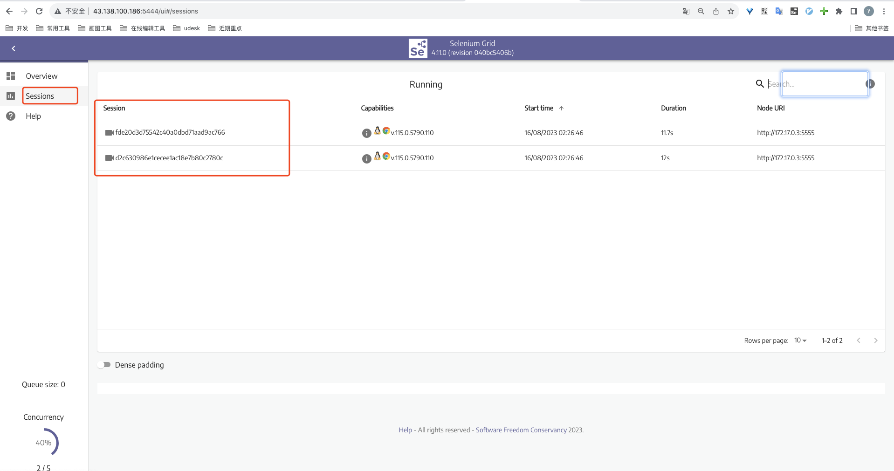
#### 查看node节点执行情况
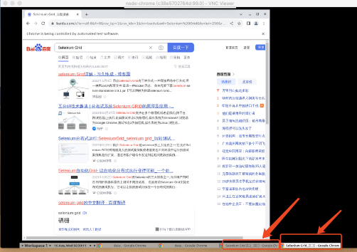
### 注意事项
1.一个浏览器实例会开一个会话</br>
2.测试数据隔离(不能出现重复的,比如2个测试用例用同一个手机号,但是手机号不允许重复,就会报错)</br>
3.每一个实例必须要支持单独运行,互不影响</br>

