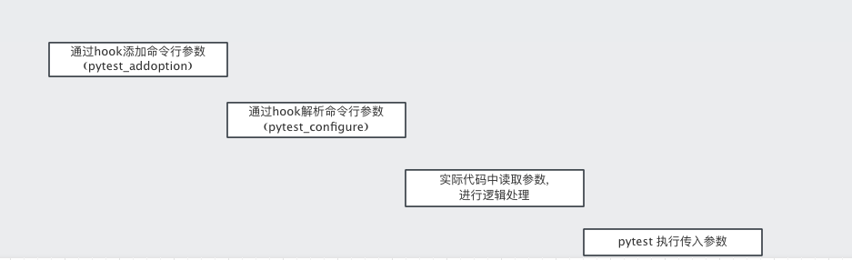
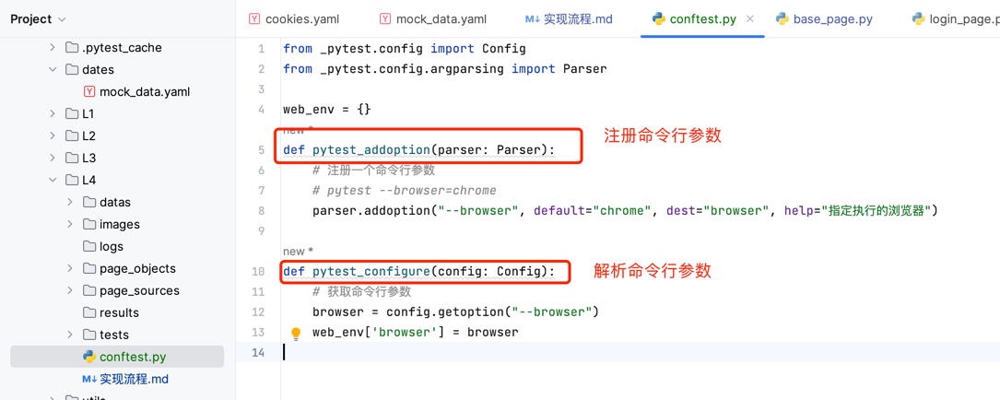
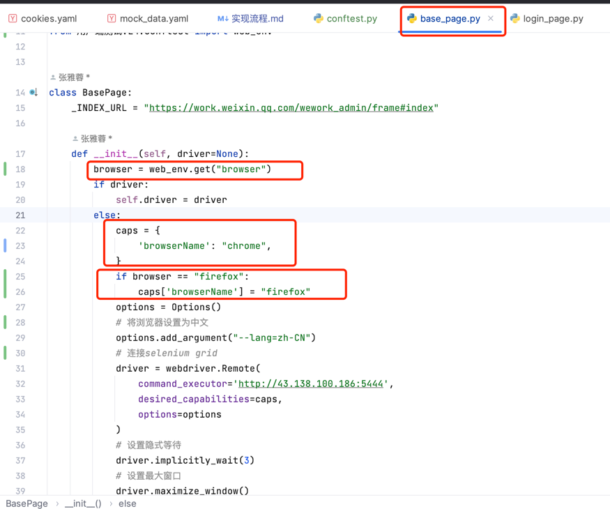
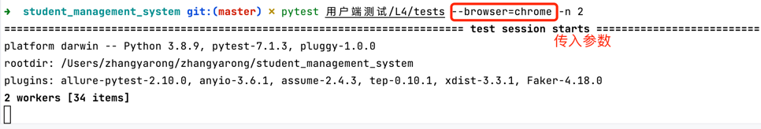
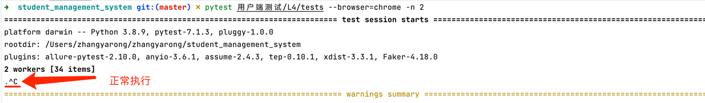
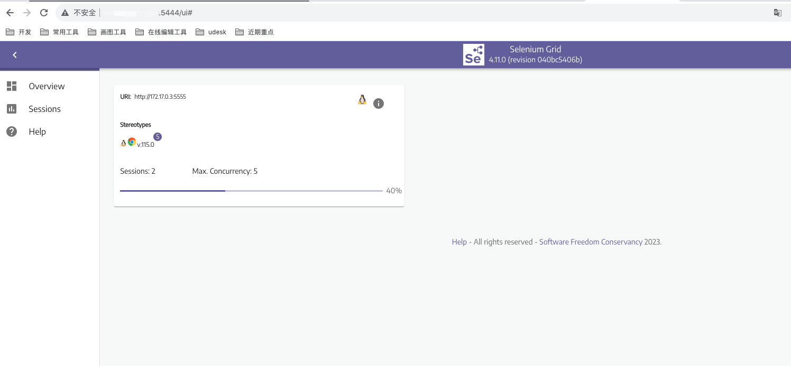
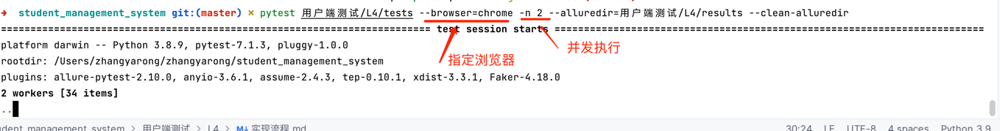
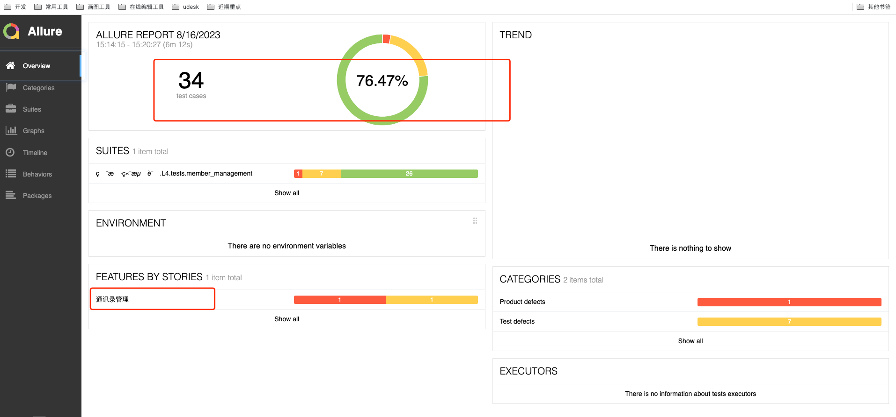
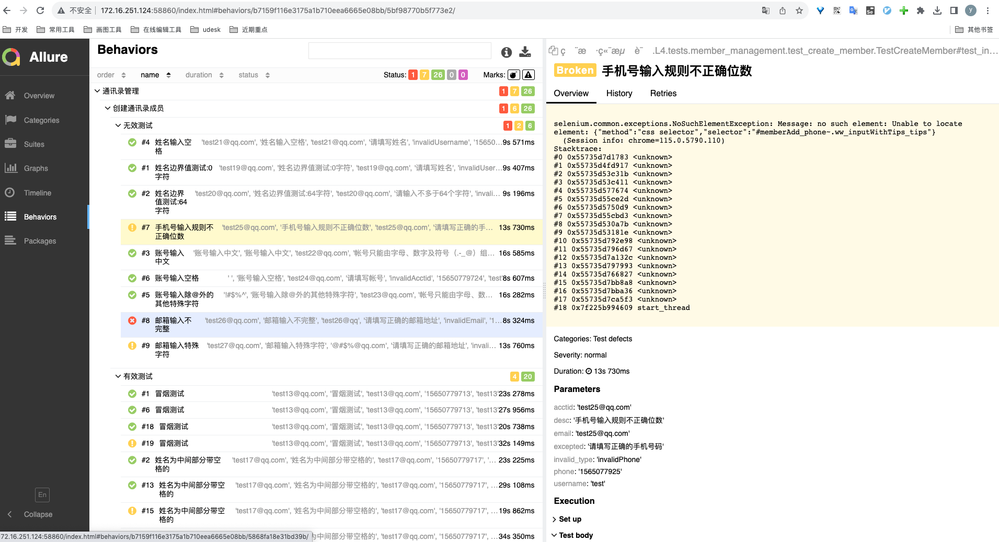

# 动态传参实现不同浏览器处理

## 实现流程


### 添加命令参数/解析命令行参数


### 逻辑处理


### 执行测试用例并传入参数



# capabilities结合Selenium Grid实现多浏览器/多并发
## 部署Selenium Grid

使用 hub/node角色部署 </br>
[部署流程](grid搭建.md)

## 代码执行

#### 执行命令

```bash
pytest 用户端测试/L4/tests --browser=chrome -n 2 --alluredir=用户端测试/L4/results --clean-alluredir
```

#### grid 执行情况



#### allure报告

